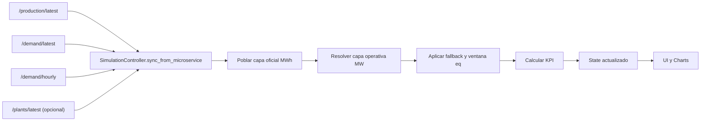
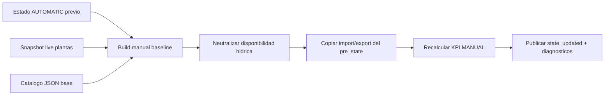
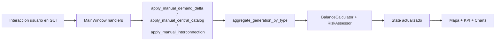
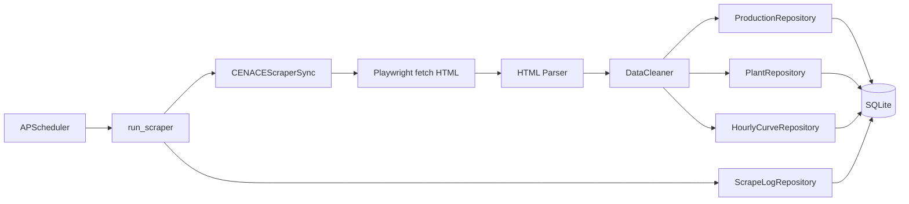

# Manual Operativo Integral del Sistema

Version: 1.3 (continuidad MANUAL con residual no catalogado)
Fecha: 2026-05-05
Alcance: Simulador desktop de matriz energetica + microservicio CENACE scraper
Publico objetivo: operadores, analistas tecnicos y evaluadores academicos

## Resumen Ejecutivo

Este documento presenta una vista integral del sistema de simulacion de matriz energetica, desde la captura de datos en CENACE hasta la visualizacion de KPI y la ejecucion de escenarios manuales. El enfoque es tecnico-operativo: explica procesos, reglas, ecuaciones, entradas/salidas y decisiones de operacion, evitando detalle de implementacion linea por linea.

Estado de cobertura:

- Arquitectura y flujos principales: completo.
- Procesos criticos con diagramas y tablas I/O: completo.
- Modelo matematico con definicion de variables y ejemplos: completo.
- GUI y microservicio con trazabilidad operativa: completo.
- Troubleshooting, limites y cierre para entrega: completo.

## Guia de Lectura

Ruta recomendada segun objetivo:

- Comprender el sistema completo: secciones 2 y 3.
- Entender por que cambia un KPI: secciones 3.3 y 5.
- Operar la GUI en escenarios what-if: secciones 6 y 9.
- Diagnosticar fallos de datos/sincronizacion: secciones 7, 8 y 10.
- Fundamentar analisis academico: secciones 5, 11 y 12.

---

## 1. Proposito del documento

Este manual explica como esta construido el sistema y como funciona en operacion real, con foco en:

- Entender el flujo de datos desde CENACE hasta los KPI mostrados al usuario.
- Entender que controla cada parte de la interfaz y como impacta el comportamiento del modelo.
- Entender entradas, transformaciones y salidas de los procesos principales.
- Entender ecuaciones, supuestos y limites del modelo de matriz energetica implementado.

Este documento evita describir linea por linea el codigo. En su lugar, describe arquitectura funcional y comportamiento operativo.

## 2. Vista general del sistema

El sistema esta compuesto por dos bloques acoplados por API local:

1. Microservicio CENACE scraper.
2. Simulador desktop.

### 2.1 Diagrama de cajas de alto nivel

```text
+-----------------------+      +------------------------------+      +------------------------------+
|  Portal CENACE        | ---> |  Microservicio Scraper       | ---> |  Simulador Desktop           |
|  (HTML dinamico)      |      |  FastAPI + Scheduler + DB    |      |  PyQt6 + Mapa + KPI + Charts |
+-----------------------+      +------------------------------+      +------------------------------+
                                          |                                        |
                                          v                                        v
                                 +------------------+                     +------------------+
                                 | SQLite historica |                     | Usuario operador |
                                 +------------------+                     +------------------+
```

### 2.2 Flujo E2E resumido


---

## 3. Arquitectura funcional del simulador

### 3.1 Capas y responsabilidades

- Capa de presentacion (UI): panel de control, mapa, graficas, interaccion del usuario.
- Capa de aplicacion: orquesta sincronizacion, cambio de modo y recalculo de estado.
- Capa de dominio: ecuaciones puras de oferta, balance, reserva, riesgo y modelo hidrico.
- Capa de infraestructura: cliente API del microservicio y bus de eventos interno.

### 3.2 Entidad principal: estado de simulacion

El estado de trabajo contiene, entre otros campos:

- Modo: AUTOMATIC o MANUAL.
- Capa operativa (MW): demanda, generacion por tecnologia e interconexion para KPI y simulacion.
- Capa oficial de reporte CENACE (MWh): total, hidro, termica, renovable, import y export.
- Metadatos de trazabilidad: fuente de demanda, fuente de oferta y ventana operativa de equivalencia.
- Residual no catalogado (MW): ajuste interno por tipo para preservar continuidad al pasar de AUTOMATIC a MANUAL cuando el catalogo no cubre toda la oferta observada.
- Interconexion: importacion y exportacion.
- Factor de sequia global.
- Timestamp de origen y timestamp de ultima edicion manual.
- KPI calculados: oferta total, balance, reserva y riesgo.

### 3.3 Entradas y salidas de procesos clave

### Proceso A: sincronizacion automatica

Diagrama de caja (vista rapida):

```text
+-----------------------------------------------------------------------------------+
| Proceso A: Sincronizacion automatica                                              |
|-----------------------------------------------------------------------------------|
| Entradas                                                                          |
| - /production/latest                                                              |
| - /demand/latest                                                                  |
| - /demand/hourly                                                                  |
| - /plants/latest (si disponible)                                                  |
|                                                                                   |
| Reglas / Transformaciones                                                         |
| - Poblar capa oficial desde /production/latest (MWh)                              |
| - Tomar ultimo punto horario efectivo para oferta operativa (MW)                  |
| - Tomar demanda operativa desde /demand/latest (MW)                               |
| - Fallback jerarquico a curva y luego a equivalente MWh->MW (ventana 24h)         |
| - Recalcular KPI: oferta, balance, reserva, riesgo                               |
|                                                                                   |
| Salidas                                                                           |
| - SimulationState en modo AUTOMATIC con capas operativa y oficial                 |
| - Payload para mapa, KPI textual y charts                                         |
+-----------------------------------------------------------------------------------+
```

Diagrama de flujo:



Entradas:

- Snapshot de produccion mas reciente desde microservicio.
- Snapshot de demanda consolidada en tiempo real.
- Curva horaria de demanda/generacion.
- Snapshot de plantas (si disponible).

Transformacion:

- Capa oficial (MWh) desde /production/latest.
- Capa operativa de oferta (MW) desde /demand/hourly usando ultimo punto util.
- Capa operativa de demanda (MW) desde /demand/latest.
- Fallback jerarquico: curva horaria -> equivalente MWh->MW usando ventana de 24h.
- Recalculo de KPI.

Salidas:

- Estado actualizado en modo AUTOMATIC con semantica explicita de unidades.
- Payload para UI y charts.

### Proceso B: cambio AUTOMATIC -> MANUAL

Diagrama de caja (vista rapida):

```text
+-----------------------------------------------------------------------------------+
| Proceso B: Transicion AUTOMATIC -> MANUAL                                         |
|-----------------------------------------------------------------------------------|
| Entradas                                                                          |
| - Estado automatico previo                                                        |
| - Catalogo base de centrales                                                      |
| - Snapshot de plantas en vivo (si util y fresco)                                 |
|                                                                                   |
| Reglas / Transformaciones                                                         |
| - Baseline MANUAL live-first                                                       |
| - Fallback a estado agregado automatico o JSON base                               |
| - Calculo de residual no catalogado por tipo contra el pre_state AUTOMATIC        |
| - Neutralizacion hidrica inicial (100%)                                           |
| - Carry-over import/export                                                         |
|                                                                                   |
| Salidas                                                                           |
| - State MANUAL coherente para what-if                                             |
| - Diagnosticos de transicion (deltas y causa)                                     |
+-----------------------------------------------------------------------------------+
```

Diagrama de flujo:



Entradas:

- Estado automatico previo.
- Catalogo base de centrales.
- Snapshot de plantas en vivo (si existe y es fresco).

Transformacion:

- Construccion de baseline MANUAL con prioridad live-first.
- Fallback a baseline desde estado agregado automatico o JSON base.
- Calculo de residual positivo por tipo: diferencia entre oferta operativa AUTOMATIC y oferta representable por el catalogo.
- Neutralizacion hidrica inicial (disponibilidad hidrica a 100 por ciento al entrar).
- Carry-over de importacion y exportacion para continuidad de oferta.

Salidas:

- Estado MANUAL coherente para iniciar analisis what-if.
- Diagnosticos de transicion (causas, diferencias y residual aplicado).

### Proceso C: edicion manual operativa

Diagrama de caja (vista rapida):

```text
+-----------------------------------------------------------------------------------+
| Proceso C: Edicion manual operativa                                               |
|-----------------------------------------------------------------------------------|
| Entradas                                                                          |
| - Demanda (delta %)                                                               |
| - Central seleccionada: estado/disponible/disp. hidrica                           |
| - Sequia global                                                                    |
| - Importacion/exportacion                                                          |
|                                                                                   |
| Reglas / Transformaciones                                                         |
| - Agregacion por planta y tecnologia                                               |
| - Modelo hidrico simplificado en HYDRO                                            |
| - Recalculo inmediato de KPI                                                       |
|                                                                                   |
| Salidas                                                                           |
| - Nuevo SimulationState                                                            |
| - Refresco sincronizado de KPI, mapa y graficas                                   |
+-----------------------------------------------------------------------------------+
```

Diagrama de flujo:



Entradas:

- Ediciones del usuario: demanda, disponibilidad por central, estado de central,
  disponibilidad hidrica, sequia global, importacion/exportacion.

Transformacion:

- Agregacion por planta y por tecnologia.
- Aplicacion de modelo hidrico simplificado en centrales HYDRO.
- Recalculo inmediato de KPI.

Salidas:

- Nuevo estado operativo.
- Refresco simultaneo de KPI, mapa y panel de graficas.

### Tabla consolidada: entradas, reglas y salidas por proceso

| Proceso | Entradas principales | Reglas de negocio | Salidas principales | Fallback/Error |
|---|---|---|---|---|
| A. Sincronizacion automatica | production/latest, demand/latest, demand/hourly, plants/latest | Capa oficial MWh + capa operativa MW, seleccion de ultimo punto util, fallback jerarquico con ventana 24h, recalc KPI | State AUTOMATIC + payload UI con fuentes | Si falla API, se conserva ultimo state valido |
| B. Cambio a MANUAL | pre_state, catalogo base, snapshot live | live-first baseline, fallback jerarquico, residual por tipo, neutralizacion hidrica, carry-over import/export | State MANUAL + diagnosticos | Si no hay live ni automatico usable, usar JSON base |
| C. Edicion manual | demanda, catalogo editado, sequia, import/export | agregacion por tipo/planta, fisica hidro simplificada, recalc KPI inmediato | State nuevo + refresco visual | Fuera de MANUAL, no aplica cambios |

### Tabla de metodos criticos del simulador

| Metodo critico | Entradas | Reglas principales | Salida |
|---|---|---|---|
| sync_from_microservice | production/latest, demand/latest, demand/hourly, plants/latest | Pobla capa oficial MWh, resuelve capa operativa MW, aplica fallback y fuente, recalc KPI | State AUTOMATIC actualizado |
| switch_mode | modo objetivo | Cambia modo; si vuelve a AUTOMATIC dispara sync | State con modo actualizado |
| apply_manual_central_catalog | catalogo centrales, sequia global, import/export opcionales | Agrega por tipo, aplica modelo hidro, preserva/copia interconexion, recalc KPI | State MANUAL recalculado |
| apply_manual_interconnection | import_mw, export_mw | Actualiza intercambio neto, recalc KPI inmediato | State MANUAL con oferta neta ajustada |
| build_manual_entry_catalog | pre_state, base_centrales, live_plants | Prioridad live-first, fallback agregado/JSON, diagnostico de causa | Catalogo baseline + fuente + diagnostico |
| calculate_manual_residual_by_type | pre_state AUTOMATIC, catalogo baseline | Compara oferta por tipo del catalogo contra oferta operativa AUTOMATIC y calcula residual positivo | Residual por tipo + diagnostico de continuidad |

---

## 4. Flujos de trabajo operativos

### 4.1 Flujo normal de observacion en tiempo real

```text
[Inicio simulador]
   -> [Sincronizacion periodica]
   -> [Modo AUTOMATIC]
   -> [Monitoreo KPI + graficas + mapa]
```

### 4.2 Flujo de analisis what-if

```text
[AUTOMATIC estable]
   -> [Guardar escenario base]
   -> [Cambiar a MANUAL]
   -> [Editar variables operativas]
   -> [Evaluar impacto en KPI]
   -> [Guardar variante]
   -> [Comparar contra base]
```

### 4.3 Flujo de recuperacion rapida

```text
[Escenario manual degradado]
   -> [Reset MANUAL]
   -> [Reinicializacion baseline]
   -> [Reaplicar cambios de forma controlada]
```

---

## 5. Modelo matematico y ecuaciones

### 5.0 Definicion de variables (notacion)

- $D$: demanda total del sistema (MW).
- $S$: oferta total neta del sistema (MW).
- $B$: balance neto del sistema (MW).
- $RM$: margen de reserva porcentual (%).
- $H$: generacion hidro agregada (MW).
- $T$: generacion termica agregada (MW).
- $R$: generacion renovable no hidro (MW), donde $R = WIND + SOLAR$.
- $I$: importacion de energia (MW).
- $E$: exportacion de energia (MW).
- $P_{hidro}$: potencia efectiva hidro de una central (MW).
- $P_{disp}$: potencia hidro disponible declarada para una central (MW).
- $F_{hidraulico}$: factor hidraulico efectivo (adimensional, entre 0 y 1).
- $DispHidrica$: disponibilidad hidrica por central (%).
- $SequiaGlobal$: penalizacion hidrica global (adimensional, entre 0 y 1).

### 5.1 Oferta total neta

La oferta neta del sistema se calcula como:

$$
S = H + T + R + I - E
$$

Donde:

- $S$: oferta total neta.
- $H$: generacion hidro.
- $T$: generacion termica.
- $R$: generacion renovable no hidro (eolica + solar).
- $I$: importacion.
- $E$: exportacion.

Interpretacion operativa:

- Aumentar importacion incrementa oferta disponible.
- Aumentar exportacion reduce oferta disponible interna.

### 5.2 Balance

$$
B = S - D
$$

Donde:

- $B$: balance neto del sistema.
- $S$: oferta total neta.
- $D$: demanda total del sistema.

- $B > 0$: superavit.
- $B < 0$: deficit.

### 5.3 Margen de reserva

$$
RM = \frac{S - D}{D} \times 100
$$

Donde:

- $RM$: margen de reserva en porcentaje.
- $S$: oferta total neta.
- $D$: demanda total del sistema.

Si $D \le 0$, el sistema devuelve 0 por estabilidad numerica.

### 5.4 Clasificacion de riesgo

La clasificacion se deriva del margen de reserva con umbrales configurables:

- SAFE si $RM \ge 20$.
- ALERT si $10 \le RM < 20$.
- CRITICAL si $0 \le RM < 10$.
- FAILURE si $RM < 0$.

### 5.5 Modelo hidrico simplificado

Para cada central hidro ONLINE:

$$
P_{hidro} = P_{disp} \times F_{hidraulico}
$$

$$
F_{hidraulico} = \left(\frac{DispHidrica}{100}\right) \times (1 - SequiaGlobal)
$$

Con limites:

- $DispHidrica \in [0,100]$.
- $SequiaGlobal \in [0,1]$.
- $F_{hidraulico} \in [0,1]$.

Interpretacion clave:

- Disp. hidrica es un factor operativo, no una medicion fisica directa del embalse.
- Sequia global penaliza transversalmente todas las centrales hidro.

### 5.6 Ejemplos numericos operativos

### Ejemplo 1: escenario base con reserva positiva

Datos de entrada:

- $H = 2,900$ MW
- $T = 1,200$ MW
- $R = 180$ MW
- $I = 120$ MW
- $E = 20$ MW
- $D = 4,000$ MW

Calculo:

$$
S = 2900 + 1200 + 180 + 120 - 20 = 4380\ MW
$$

$$
B = S - D = 4380 - 4000 = 380\ MW
$$

$$
RM = \frac{4380 - 4000}{4000} \times 100 = 9.5\%
$$

Interpretacion:

- Hay superavit ($B > 0$), pero reserva moderada (9.5%), con riesgo operacional entre ALERT/CRITICAL segun umbral configurado.

### Ejemplo 2: escenario de estres con deficit

Datos de entrada:

- $H = 2,100$ MW
- $T = 850$ MW
- $R = 140$ MW
- $I = 40$ MW
- $E = 90$ MW
- $D = 3,600$ MW

Calculo:

$$
S = 2100 + 850 + 140 + 40 - 90 = 3040\ MW
$$

$$
B = 3040 - 3600 = -560\ MW
$$

$$
RM = \frac{3040 - 3600}{3600} \times 100 = -15.56\%
$$

Interpretacion:

- Hay deficit severo ($B < 0$) y margen negativo, por lo que el riesgo esperado es FAILURE.

### Ejemplo 3: continuidad de import/export al pasar a MANUAL

Estado pre-switch (AUTOMATIC):

- $H = 2,950$ MW, $T = 1,320$ MW, $R = 20$ MW
- $I = 150$ MW, $E = 60$ MW, $D = 4,100$ MW

Oferta pre-switch:

$$
S_{pre} = 2950 + 1320 + 20 + 150 - 60 = 4380\ MW
$$

Caso sin carry-over (hipotetico incorrecto, $I=E=0$):

$$
S_{sin\ carry} = 2950 + 1320 + 20 + 0 - 0 = 4290\ MW
$$

Perdida artificial:

$$
\Delta S = 4290 - 4380 = -90\ MW
$$

Caso implementado (con carry-over):

$$
S_{con\ carry} = 2950 + 1320 + 20 + 150 - 60 = 4380\ MW
$$

Interpretacion:

- Preservar import/export evita un salto artificial de 90 MW en oferta al pasar a MANUAL.

---

## 6. GUI operativa: que controla cada panel

### 6.1 Panel de control (lado izquierdo)

### Bloque de modo y sincronizacion

- Sincronizar ahora: fuerza lectura de microservicio.
- Cambiar a MANUAL/AUTOMATIC: alterna fuente de verdad del estado.
- Estado textual: informa origen del baseline y eventos relevantes.

### Bloque detalle de central

Controles principales:

- Tipo, region, instalada.
- Disponible MW.
- Estado: ONLINE, OFFLINE, MAINTENANCE.
- Disp. hidrica por central (solo HYDRO en MANUAL).

Efecto:

- Modifica generacion agregada por tecnologia y por planta.

### Bloque sequia global

- Slider de 0 a 100 por ciento.
- Afecta solo centrales HYDRO via factor hidraulico.

### Bloque interconexion

- Importacion MW y Exportacion MW.
- Solo habilitado en MANUAL.
- Recalculo inmediato de KPI.

### Bloque escenarios

- Guardar, restaurar, duplicar, descartar.
- Persistencia local en JSON.

### Bloque KPI textual

Presenta:

- Bloque operativo (MW): demanda, oferta por tecnologia, import/export, oferta total, balance, reserva y riesgo.
- Bloque oficial CENACE (MWh): total, hidro, termica, renovable, import y export.
- Metadatos: fuente de demanda, fuente de oferta y nota de ventana de equivalencia cuando aplica.
- Residual no catalogado (MW): valor agregado usado en MANUAL cuando existe brecha entre catalogo y oferta observada en AUTOMATIC.

### 6.2 Mapa

El mapa representa centrales y su estado operativo estimado:

- Marcadores por tecnologia con codificacion visual.
- Popups con datos operativos por central.
- Overlay de utilizacion por tipo y por planta.

### 6.3 Panel de graficas

Visuales principales:

- Estado operativo instantaneo.
- Dona de mix de generacion por tipo.
- Barras demanda vs oferta.
- Reserva e intercambios (import/export).
- Tendencia temporal.

Fuente de timeline:

- AUTOMATIC: preferencia por curva horaria del microservicio.
- MANUAL o fallback: historial de sesion generado en el cliente.

Semantica de unidades en panel:

- KPI de graficas se interpretan como operativos en MW.
- Se muestra nota explicita de que el reporte oficial de CENACE corresponde a MWh.
- Se muestra fuente de demanda/oferta y ventana de equivalencia cuando la oferta proviene de conversion MWh->MW.
- Si existe residual no catalogado, este se interpreta como oferta operativa agregada, no asignada a una planta concreta del mapa.

---

## 7. Microservicio CENACE scraper en profundidad

### 7.1 Responsabilidad principal

Transformar HTML dinamico de CENACE en datos estructurados y consultables por API para el simulador.

### 7.2 Pipeline funcional

```text
[Scheduler]
   -> ejecuta run_scraper
   -> [Scraper Playwright]
   -> [Parser HTML]
   -> [DataCleaner]
   -> [Persistencia repositorios]
   -> [Logs de scraping]
```

Diagrama de flujo de pipeline:



### 7.3 Cajas funcionales del microservicio

### Caja 1: Scraper Playwright

Diagrama de caja:

```text
+-----------------------------------------------------------------------------------+
| Caja 1: Scraper Playwright                                                        |
|-----------------------------------------------------------------------------------|
| Entradas                                                                          |
| - URL CENACE                                                                      |
| - Timeout, wait_selector, headless                                                |
|                                                                                   |
| Reglas                                                                            |
| - Abrir Chromium real                                                             |
| - Esperar selector de disponibilidad de datos                                     |
| - Reintentos con backoff exponencial                                              |
|                                                                                   |
| Salidas                                                                           |
| - HTML final renderizado                                                           |
+-----------------------------------------------------------------------------------+
```

Lectura operativa:

- Entrada tipica: URL CENACE + parametros de ejecucion Playwright.
- Regla principal: render real con espera de selector y reintentos controlados.
- Salida util: HTML renderizado para parser.

### Caja 2: Parser

Diagrama de caja:

```text
+-----------------------------------------------------------------------------------+
| Caja 2: Parser HTML                                                               |
|-----------------------------------------------------------------------------------|
| Entradas                                                                          |
| - HTML renderizado                                                                 |
|                                                                                   |
| Reglas                                                                            |
| - Extraer resumen energetico                                                       |
| - Extraer detalle por planta                                                       |
| - Extraer curva horaria                                                            |
|                                                                                   |
| Salidas                                                                           |
| - Datos crudos: production + plants + hourly_curve                                |
+-----------------------------------------------------------------------------------+
```

Lectura operativa:

- Entrada tipica: HTML renderizado.
- Regla principal: extraer resumen, detalle por planta y curva horaria.
- Salida util: estructura cruda de produccion, plantas y curva.

### Caja 3: Limpieza y validacion

Diagrama de caja:

```text
+-----------------------------------------------------------------------------------+
| Caja 3: DataCleaner                                                               |
|-----------------------------------------------------------------------------------|
| Entradas                                                                          |
| - Datos crudos parseados                                                           |
|                                                                                   |
| Reglas                                                                            |
| - Normalizar tipos y redondeo                                                      |
| - Validar rangos y coherencia                                                      |
| - Completar defaults                                                               |
|                                                                                   |
| Salidas                                                                           |
| - Payload limpio listo para persistencia                                           |
+-----------------------------------------------------------------------------------+
```

Lectura operativa:

- Entrada tipica: datos crudos parseados.
- Regla principal: normalizacion + validacion de coherencia.
- Salida util: payload limpio para persistencia.

### Caja 4: Persistencia

Diagrama de caja:

```text
+-----------------------------------------------------------------------------------+
| Caja 4: Persistencia en SQLite                                                    |
|-----------------------------------------------------------------------------------|
| Entradas                                                                          |
| - Snapshot de produccion                                                           |
| - Registros de plantas                                                             |
| - Curva horaria                                                                    |
|                                                                                   |
| Reglas                                                                            |
| - Insert batch por repositorio                                                     |
| - Registrar log de exito/error                                                     |
|                                                                                   |
| Salidas                                                                           |
| - Tablas historicas actualizadas                                                   |
| - Metricas de ejecucion                                                            |
+-----------------------------------------------------------------------------------+
```

Lectura operativa:

- Entrada tipica: snapshot agregado, plantas y curva horaria.
- Regla principal: insercion en tablas historicas + logging de ejecucion.
- Salida util: datos persistidos y trazabilidad de salud.

### Caja 5: API FastAPI

Diagrama de caja:

```text
+-----------------------------------------------------------------------------------+
| Caja 5: API FastAPI                                                               |
|-----------------------------------------------------------------------------------|
| Entradas                                                                          |
| - Consultas HTTP de simulador/operador                                             |
|                                                                                   |
| Reglas                                                                            |
| - Leer ultimo snapshot o historico                                                 |
| - Serializar respuesta con schemas Pydantic                                        |
|                                                                                   |
| Salidas                                                                           |
| - JSON de endpoints /production, /plants, /demand, /health, /logs                 |
+-----------------------------------------------------------------------------------+
```

Lectura operativa:

- Entrada tipica: consultas HTTP de simulador y operadores.
- Regla principal: consulta por endpoint y serializacion tipada.
- Salida util: JSON operativo para consumo del cliente.

### 7.4 Endpoints de integracion criticos

- Health del servicio.
- Produccion latest.
- Demanda latest.
- Curva horaria demand/hourly.
- Plantas latest.

Estos endpoints son la interfaz de contrato principal con el simulador.

### Tabla operativa de endpoints y uso en simulador

| Endpoint | Proposito | Entrada | Campos de salida criticos | Uso en simulador | Fallback |
|---|---|---|---|---|---|
| GET /api/v1/health | Salud del servicio | Ninguna | status, last_scrape, success_rate | Verificacion pre-operacion | Si falla, trabajar en MANUAL con ultimo state |
| GET /api/v1/production/latest | Snapshot oficial agregado mas reciente (MWh) | Ninguna | total_mwh, hydro_mwh, thermal_mwh, renewable_mwh, import_mwh, export_mwh, timestamp | Fuente de capa oficial en AUTOMATIC | Si no hay curva, convertir a MW equivalente (24h) |
| GET /api/v1/demand/latest | Demanda nacional consolidada en tiempo real (MW) | Ninguna | demand_total_mw, demand_cnel_mw, demand_empresas_mw, timestamp | Fuente primaria de demanda operativa en AUTOMATIC | Si falla, usar demand/hourly o equivalencia desde production/latest |
| GET /api/v1/demand/hourly | Curva horaria de demanda y generacion (MW) | date opcional | demand_mw, hydro_mw, thermal_mw, renewable_mw, import_mw, export_mw | Fuente primaria de oferta operativa y timeline charts | Si curva invalida, usar equivalencia desde production/latest |
| GET /api/v1/plants/latest | Detalle por planta del ultimo timestamp | Ninguna | plant_id, plant_name, plant_type, mwh | Baseline MANUAL live-first y overlay por planta | Si falla, continuar con ultimo snapshot de plantas |
| GET /api/v1/logs | Diagnostico de scraping | limit opcional | success, error_message, duration_seconds | Soporte de troubleshooting operativo | No bloquea simulacion |

---

## 8. Contratos de integracion y continuidad de datos

### 8.1 Contrato semantico de campos clave

- Capa oficial (reporte): total_mwh, hydro_mwh, thermal_mwh, renewable_mwh, import_mwh, export_mwh en /production/latest.
- Capa operativa (simulacion): demand_mw desde /demand/latest y oferta por tecnologia desde /demand/hourly.
- En ausencia de curva util, se usa equivalencia MWh->MW con ventana de 24h para continuidad operativa.
- import/export en curva son operativos (MW); en snapshot son reporte oficial (MWh).

### 8.1.1 Regla de conversion de equivalencia

Cuando se requiere continuidad operativa sin curva util:

$$
P_{eq}(MW) = \frac{E(MWh)}{Ventana(h)}
$$

Donde la ventana por defecto es 24h.

Ejemplo:

$$
23714\ MWh \div 24\ h = 988.08\ MW
$$

### 8.2 Politica de frescura y fallback

En sincronizacion AUTOMATIC (demanda/oferta):

1. Demanda operativa: /demand/latest.
2. Si falla: ultimo punto util de /demand/hourly.
3. Si tambien falla: equivalencia desde /production/latest con ventana de 24h.

1. Oferta operativa: ultimo punto util de /demand/hourly.
2. Si falla: equivalencia desde /production/latest con ventana de 24h.

Al pasar de AUTOMATIC a MANUAL:

1. Se intenta baseline desde snapshot de plantas en vivo si es util y fresco.
2. Si no aplica, se usa estado agregado automatico.
3. Si tampoco aplica, se usa JSON base de catalogo.
4. En todos los casos, si el catalogo resultante no alcanza la oferta operativa AUTOMATIC, se aplica un residual no catalogado positivo por tipo.

Esta jerarquia reduce saltos abruptos no deseados.

### 8.2.1 Regla del residual no catalogado

El residual solo se usa para continuidad de oferta al entrar a MANUAL. No reescribe la capacidad instalada del catalogo ni se asigna a una central real.

Regla:

$$
Residual_{tipo} = max(0, OfertaAutomatic_{tipo} - OfertaCatalogo_{tipo})
$$

Propiedades operativas:

- Nunca aumenta `installed_capacity_mw` de una central real.
- Mantiene continuidad visual y numerica en KPI al cambiar de modo.
- Representa produccion privada, no catalogada o diferencias entre fuentes CENACE.
- Se muestra como agregado y no como marcador de mapa.

### 8.3 Continuidad import/export

La interconexion del estado automatico se preserva al entrar a MANUAL mediante carry-over.

Impacto operativo:

- Evita perdida artificial de oferta en la transicion.
- Mantiene comparabilidad de KPI pre y post cambio de modo.

---

## 9. Operacion estandar

### 9.1 Secuencia recomendada

1. Iniciar microservicio.
2. Verificar endpoint de health.
3. Iniciar simulador.
4. Confirmar sincronizacion AUTOMATIC.
5. Guardar escenario base.
6. Cambiar a MANUAL para analisis what-if.
7. Aplicar cambios controlados en una variable por vez.
8. Guardar variantes y comparar.

### 9.2 Checklist operativo rapido

Antes de analizar:

- Microservicio saludable.
- Datos recientes disponibles.
- Riesgo y reserva de referencia registrados.

Durante analisis:

- Cambiar una sola variable por iteracion.
- Registrar impacto en oferta, balance y reserva.

Despues de analisis:

- Guardar escenario final.
- Restaurar baseline para siguiente experimento.

---

## 10. Troubleshooting operacional

### 10.1 Sintoma -> causa -> accion

### Caso 1

Sintoma:

- Error de conexion o no hay actualizacion en AUTOMATIC.

Causa probable:

- Microservicio detenido o endpoint no disponible.

Accion:

- Verificar health.
- Reiniciar microservicio y luego simulador.

### Caso 2

Sintoma:

- Salto fuerte al pasar a MANUAL.

Causa probable:

- Fallback a baseline menos representativo o cambios de disponibilidad hidrica.

Accion:

- Revisar diagnostico de mode switch.
- Ejecutar Reset MANUAL.
- Confirmar sequia global en 0 antes de reintentar.

### Caso 3

Sintoma:

- KPI no cambia al editar.

Causa probable:

- Edicion fuera de MANUAL o central no aplico cambios.

Accion:

- Confirmar modo MANUAL.
- Verificar seleccion de central y aplicar edicion.

### Caso 4

Sintoma:

- Fallo Playwright en Windows con asyncio subprocess.

Causa probable:

- Configuracion de reload incompatible para ejecucion operativa.

Accion:

- Ejecutar con API_RELOAD en falso para entorno estable.

### Caso 5

Sintoma:

- Confusion entre magnitudes muy altas (MWh) y valores operativos (MW).

Causa probable:

- Lectura cruzada de capa oficial y capa operativa sin considerar unidades.

Accion:

- Verificar en KPI textual el bloque "Operativo (MW)" frente a "Resumen CENACE (MWh)".
- Confirmar fuentes en estado: demand_source y supply_source.
- Si hay conversion, revisar nota de ventana de equivalencia (eq 24h).

### Caso 6

Sintoma:

- La oferta cae al pasar de AUTOMATIC a MANUAL.

Causa probable:

- El catalogo no cubre toda la oferta del estado AUTOMATIC o parte del detalle live no encuentra match contra el JSON.

Accion:

- Revisar diagnosticos de cambio de modo: `mapped_by_type_mw`, `unmatched_pool_by_type` y `residual_by_type_mw`.
- Confirmar que se aplico residual no catalogado cuando existe gap positivo.
- Si el residual es persistentemente alto, mejorar catalogo y matching en una iteracion aparte.

---

## 11. Limites y supuestos del modelo

- El modelo representa comportamiento operativo agregado, no flujo AC completo de red.
- El modelo hidrico es simplificado y no resuelve dinamica temporal multihora de embalse.
- El mapeo de nombres de plantas entre fuente live y catalogo local usa heuristicas.
- Import/export no se persisten en escenarios guardados por diseno actual.

Estos limites deben explicitarse al interpretar resultados.

---

## 12. Trazabilidad documento a componentes

Este manual se fundamenta en comportamiento implementado en:

- Simulador: capas UI, aplicacion, dominio e infraestructura.
- Microservicio: scheduler, scraper, parser, cleaner, repositorios, API.
- Pruebas: flujos de controlador, consistencia central-KPI y flujo E2E.

---

## 13. Conclusiones Operativas

1. El sistema mantiene separacion clara entre adquisicion de datos (microservicio) y simulacion operativa (desktop), lo que facilita diagnostico y evolucion.
2. La continuidad AUTOMATIC -> MANUAL se gestiona de forma controlada mediante baseline jerarquico, neutralizacion hidrica de entrada y carry-over de import/export.
3. Los KPI se recalculan con reglas deterministas y trazables, permitiendo auditoria tecnica y comparacion de escenarios.
4. El modelo es adecuado para analisis operativo y pedagogico, con limites explicitados para evitar sobreinterpretacion fisica.
5. El documento queda apto para entrega academica/profesional al integrar arquitectura, metodos, ecuaciones, visualizacion y guias de operacion en un unico artefacto.

---

## 14. Glosario

- AUTOMATIC: modo de estado sincronizado con microservicio.
- MANUAL: modo de simulacion editable para escenarios.
- Baseline: punto de partida operativo de una sesion manual.
- Carry-over: transferencia de valores entre estados para continuidad.
- Disp. hidrica: factor operativo de disponibilidad de generacion hidro.
- Reserva: margen porcentual entre oferta neta y demanda.
- Riesgo: clasificacion cualitativa derivada de la reserva.

---

## 15. Anexo A: diagrama I/O del nucleo de simulacion

```text
+--------------------------------------------------------------+
| Nucleo de simulacion                                         |
|                                                              |
| Entradas:                                                    |
| - Demand delta                                               |
| - Catalogo centrales (status, disponible, disp. hidrica)     |
| - Sequia global                                              |
| - Importacion / Exportacion                                  |
| - Snapshot externo (modo AUTOMATIC)                          |
|                                                              |
| Transformaciones:                                            |
| - Agregacion por planta/tipo                                 |
| - Modelo hidrico simplificado                                |
| - Ecuaciones de oferta, balance y reserva                    |
| - Clasificacion de riesgo                                    |
|                                                              |
| Salidas:                                                     |
| - Estado de simulacion actualizado                           |
| - KPI (oferta, balance, reserva, riesgo)                     |
| - Payload para mapa y graficas                               |
+--------------------------------------------------------------+
```

## 16. Anexo B: diagrama I/O del microservicio

```text
+--------------------------------------------------------------+
| Microservicio CENACE Scraper                                 |
|                                                              |
| Entradas:                                                    |
| - URL CENACE                                                 |
| - Parametros scheduler y Playwright                          |
| - Consultas API                                              |
|                                                              |
| Transformaciones:                                            |
| - Render HTML con browser real                               |
| - Parseo de resumen, plantas y curva                         |
| - Limpieza y validacion                                      |
| - Persistencia en SQLite                                     |
| - Exposicion via endpoints FastAPI                           |
|                                                              |
| Salidas:                                                     |
| - /production/latest                                         |
| - /plants/latest                                             |
| - /demand/hourly                                             |
| - /health y /logs                                            |
+--------------------------------------------------------------+
```

Fin del documento.
