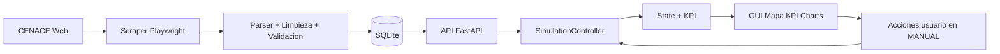

# Manual Operativo Integral del Sistema

Version: 1.0 (borrador operativo inicial)
Fecha: 2026-05-04
Alcance: Simulador desktop de matriz energetica + microservicio CENACE scraper

## Estado de elaboracion por fases

- Fase 1: Alcance, objetivos, arquitectura macro. Completada.
- Fase 2: Arquitectura funcional del simulador y flujos de modo. Completada.
- Fase 3: Modelo matematico, reglas de negocio y ecuaciones. Completada.
- Fase 4: GUI operativa y lectura de paneles. Completada.
- Fase 5: Microservicio en profundidad. Completada.
- Fase 6: Contratos de integracion y continuidad AUTOMATIC-MANUAL. Completada.
- Fase 7: Operacion y troubleshooting. Completada.
- Fase 8: Trazabilidad y limites del modelo. Completada.

---

## 1. Proposito del documento

Este manual explica como esta construido el sistema y como funciona en operacion real, con foco en:

- Entender el flujo de datos desde CENACE hasta los KPI mostrados al usuario.
- Entender que controla cada parte de la interfaz y como impacta el comportamiento del modelo.
- Entender entradas, transformaciones y salidas de los procesos principales.
- Entender ecuaciones, supuestos y limites del modelo de matriz energetica implementado.

Este documento evita describir linea por linea el codigo. En su lugar, describe arquitectura funcional y comportamiento operativo.

## 2. Vista general del sistema

El sistema esta compuesto por dos bloques acoplados por API local:

1. Microservicio CENACE scraper.
2. Simulador desktop.

### 2.1 Diagrama de cajas de alto nivel

```text
+-----------------------+      +------------------------------+      +------------------------------+
|  Portal CENACE        | ---> |  Microservicio Scraper       | ---> |  Simulador Desktop           |
|  (HTML dinamico)      |      |  FastAPI + Scheduler + DB    |      |  PyQt6 + Mapa + KPI + Charts |
+-----------------------+      +------------------------------+      +------------------------------+
                                          |                                        |
                                          v                                        v
                                 +------------------+                     +------------------+
                                 | SQLite historica |                     | Usuario operador |
                                 +------------------+                     +------------------+
```

### 2.2 Flujo E2E resumido



---

## 3. Arquitectura funcional del simulador

## 3.1 Capas y responsabilidades

- Capa de presentacion (UI): panel de control, mapa, graficas, interaccion del usuario.
- Capa de aplicacion: orquesta sincronizacion, cambio de modo y recalculo de estado.
- Capa de dominio: ecuaciones puras de oferta, balance, reserva, riesgo y modelo hidrico.
- Capa de infraestructura: cliente API del microservicio y bus de eventos interno.

## 3.2 Entidad principal: estado de simulacion

El estado de trabajo contiene, entre otros campos:

- Modo: AUTOMATIC o MANUAL.
- Demanda total.
- Generacion por tecnologia: hidro, termica, renovable.
- Interconexion: importacion y exportacion.
- Factor de sequia global.
- Timestamp de origen y timestamp de ultima edicion manual.
- KPI calculados: oferta total, balance, reserva y riesgo.

## 3.3 Entradas y salidas de procesos clave

### Proceso A: sincronizacion automatica

Entradas:

- Snapshot de produccion mas reciente desde microservicio.
- Curva horaria de demanda/generacion.
- Snapshot de plantas (si disponible).

Transformacion:

- Seleccion del ultimo punto horario util (evita colas con ceros).
- Fallback a snapshot agregado si faltan valores horarios.
- Recalculo de KPI.

Salidas:

- Estado actualizado en modo AUTOMATIC.
- Payload para UI y charts.

### Proceso B: cambio AUTOMATIC -> MANUAL

Entradas:

- Estado automatico previo.
- Catalogo base de centrales.
- Snapshot de plantas en vivo (si existe y es fresco).

Transformacion:

- Construccion de baseline MANUAL con prioridad live-first.
- Fallback a baseline desde estado agregado automatico o JSON base.
- Neutralizacion hidrica inicial (disponibilidad hidrica a 100 por ciento al entrar).
- Carry-over de importacion y exportacion para continuidad de oferta.

Salidas:

- Estado MANUAL coherente para iniciar analisis what-if.
- Diagnosticos de transicion (causas y diferencias).

### Proceso C: edicion manual operativa

Entradas:

- Ediciones del usuario: demanda, disponibilidad por central, estado de central,
  disponibilidad hidrica, sequia global, importacion/exportacion.

Transformacion:

- Agregacion por planta y por tecnologia.
- Aplicacion de modelo hidrico simplificado en centrales HYDRO.
- Recalculo inmediato de KPI.

Salidas:

- Nuevo estado operativo.
- Refresco simultaneo de KPI, mapa y panel de graficas.

---

## 4. Flujos de trabajo operativos

## 4.1 Flujo normal de observacion en tiempo real

```text
[Inicio simulador]
   -> [Sincronizacion periodica]
   -> [Modo AUTOMATIC]
   -> [Monitoreo KPI + graficas + mapa]
```

## 4.2 Flujo de analisis what-if

```text
[AUTOMATIC estable]
   -> [Guardar escenario base]
   -> [Cambiar a MANUAL]
   -> [Editar variables operativas]
   -> [Evaluar impacto en KPI]
   -> [Guardar variante]
   -> [Comparar contra base]
```

## 4.3 Flujo de recuperacion rapida

```text
[Escenario manual degradado]
   -> [Reset MANUAL]
   -> [Reinicializacion baseline]
   -> [Reaplicar cambios de forma controlada]
```

---

## 5. Modelo matematico y ecuaciones

## 5.1 Oferta total neta

La oferta neta del sistema se calcula como:

$$
S = H + T + R + I - E
$$

Donde:

- $S$: oferta total neta.
- $H$: generacion hidro.
- $T$: generacion termica.
- $R$: generacion renovable no hidro (eolica + solar).
- $I$: importacion.
- $E$: exportacion.

Interpretacion operativa:

- Aumentar importacion incrementa oferta disponible.
- Aumentar exportacion reduce oferta disponible interna.

## 5.2 Balance

$$
B = S - D
$$

- $B > 0$: superavit.
- $B < 0$: deficit.

## 5.3 Margen de reserva

$$
RM = \frac{S - D}{D} \times 100
$$

Si $D \le 0$, el sistema devuelve 0 por estabilidad numerica.

## 5.4 Clasificacion de riesgo

La clasificacion se deriva del margen de reserva con umbrales configurables:

- SAFE si $RM \ge 20$.
- ALERT si $10 \le RM < 20$.
- CRITICAL si $0 \le RM < 10$.
- FAILURE si $RM < 0$.

## 5.5 Modelo hidrico simplificado

Para cada central hidro ONLINE:

$$
P_{hidro} = P_{disp} \times F_{hidraulico}
$$

$$
F_{hidraulico} = \left(\frac{DispHidrica}{100}\right) \times (1 - SequiaGlobal)
$$

Con limites:

- $DispHidrica \in [0,100]$.
- $SequiaGlobal \in [0,1]$.
- $F_{hidraulico} \in [0,1]$.

Interpretacion clave:

- Disp. hidrica es un factor operativo, no una medicion fisica directa del embalse.
- Sequia global penaliza transversalmente todas las centrales hidro.

---

## 6. GUI operativa: que controla cada panel

## 6.1 Panel de control (lado izquierdo)

### Bloque de modo y sincronizacion

- Sincronizar ahora: fuerza lectura de microservicio.
- Cambiar a MANUAL/AUTOMATIC: alterna fuente de verdad del estado.
- Estado textual: informa origen del baseline y eventos relevantes.

### Bloque detalle de central

Controles principales:

- Tipo, region, instalada.
- Disponible MW.
- Estado: ONLINE, OFFLINE, MAINTENANCE.
- Disp. hidrica por central (solo HYDRO en MANUAL).

Efecto:

- Modifica generacion agregada por tecnologia y por planta.

### Bloque sequia global

- Slider de 0 a 100 por ciento.
- Afecta solo centrales HYDRO via factor hidraulico.

### Bloque interconexion

- Importacion MW y Exportacion MW.
- Solo habilitado en MANUAL.
- Recalculo inmediato de KPI.

### Bloque escenarios

- Guardar, restaurar, duplicar, descartar.
- Persistencia local en JSON.

### Bloque KPI textual

Presenta:

- Demanda.
- Hidro, termica, renovable.
- Import y export.
- Oferta total.
- Balance.
- Reserva.
- Riesgo.

## 6.2 Mapa

El mapa representa centrales y su estado operativo estimado:

- Marcadores por tecnologia con codificacion visual.
- Popups con datos operativos por central.
- Overlay de utilizacion por tipo y por planta.

## 6.3 Panel de graficas

Visuales principales:

- Estado operativo instantaneo.
- Dona de mix de generacion por tipo.
- Barras demanda vs oferta.
- Reserva e intercambios (import/export).
- Tendencia temporal.

Fuente de timeline:

- AUTOMATIC: preferencia por curva horaria del microservicio.
- MANUAL o fallback: historial de sesion generado en el cliente.

---

## 7. Microservicio CENACE scraper en profundidad

## 7.1 Responsabilidad principal

Transformar HTML dinamico de CENACE en datos estructurados y consultables por API para el simulador.

## 7.2 Pipeline funcional

```text
[Scheduler]
   -> ejecuta run_scraper
   -> [Scraper Playwright]
   -> [Parser HTML]
   -> [DataCleaner]
   -> [Persistencia repositorios]
   -> [Logs de scraping]
```

## 7.3 Cajas funcionales del microservicio

### Caja 1: Scraper Playwright

Entrada:

- URL de CENACE.
- Timeout, selector de espera, modo headless.

Transformacion:

- Renderiza pagina en navegador real.
- Espera selector objetivo.
- Extrae HTML final del DOM.
- Reintenta con backoff exponencial ante fallos.

Salida:

- HTML renderizado listo para parsear.

### Caja 2: Parser

Entrada:

- HTML renderizado.

Transformacion:

- Extrae resumen energetico (total, hidro, termica, renovable, import, export).
- Extrae detalle por central.
- Extrae curva horaria.
- Valida coherencia basica de datos.

Salida:

- Estructura cruda de produccion, plantas y curva.

### Caja 3: Limpieza y validacion

Entrada:

- Datos crudos parseados.

Transformacion:

- Normaliza tipos numericos.
- Redondea y aplica defaults.
- Valida rangos y coherencia interna.

Salida:

- Payload limpio y consistente para persistencia.

### Caja 4: Persistencia

Entrada:

- Snapshot de produccion.
- Lista de plantas.
- Curva horaria.

Transformacion:

- Inserta en tablas historicas.
- Registra log de ejecucion.

Salida:

- Estado persistido en SQLite.
- Metricas de salud y exito disponibles.

### Caja 5: API FastAPI

Entrada:

- Consultas del simulador u operadores.

Transformacion:

- Recupera ultimo snapshot o historicos segun endpoint.
- Serializa con schemas tipados.

Salida:

- JSON para consumo por cliente.

## 7.4 Endpoints de integracion criticos

- Health del servicio.
- Produccion latest.
- Curva horaria demand/hourly.
- Plantas latest.

Estos endpoints son la interfaz de contrato principal con el simulador.

---

## 8. Contratos de integracion y continuidad de datos

## 8.1 Contrato semantico de campos clave

- total_mwh en produccion latest: energia total reportada por fuente externa.
- hydro_mw, thermal_mw, renewable_mw en curva horaria: potencia por bloque temporal.
- import/export en curva y en snapshot: intercambio neto con sistemas vecinos.

## 8.2 Politica de frescura y fallback

Al pasar de AUTOMATIC a MANUAL:

1. Se intenta baseline desde snapshot de plantas en vivo si es util y fresco.
2. Si no aplica, se usa estado agregado automatico.
3. Si tampoco aplica, se usa JSON base de catalogo.

Esta jerarquia reduce saltos abruptos no deseados.

## 8.3 Continuidad import/export

La interconexion del estado automatico se preserva al entrar a MANUAL mediante carry-over.

Impacto operativo:

- Evita perdida artificial de oferta en la transicion.
- Mantiene comparabilidad de KPI pre y post cambio de modo.

---

## 9. Operacion estandar

## 9.1 Secuencia recomendada

1. Iniciar microservicio.
2. Verificar endpoint de health.
3. Iniciar simulador.
4. Confirmar sincronizacion AUTOMATIC.
5. Guardar escenario base.
6. Cambiar a MANUAL para analisis what-if.
7. Aplicar cambios controlados en una variable por vez.
8. Guardar variantes y comparar.

## 9.2 Checklist operativo rapido

Antes de analizar:

- Microservicio saludable.
- Datos recientes disponibles.
- Riesgo y reserva de referencia registrados.

Durante analisis:

- Cambiar una sola variable por iteracion.
- Registrar impacto en oferta, balance y reserva.

Despues de analisis:

- Guardar escenario final.
- Restaurar baseline para siguiente experimento.

---

## 10. Troubleshooting operacional

## 10.1 Sintoma -> causa -> accion

### Caso 1

Sintoma:

- Error de conexion o no hay actualizacion en AUTOMATIC.

Causa probable:

- Microservicio detenido o endpoint no disponible.

Accion:

- Verificar health.
- Reiniciar microservicio y luego simulador.

### Caso 2

Sintoma:

- Salto fuerte al pasar a MANUAL.

Causa probable:

- Fallback a baseline menos representativo o cambios de disponibilidad hidrica.

Accion:

- Revisar diagnostico de mode switch.
- Ejecutar Reset MANUAL.
- Confirmar sequia global en 0 antes de reintentar.

### Caso 3

Sintoma:

- KPI no cambia al editar.

Causa probable:

- Edicion fuera de MANUAL o central no aplico cambios.

Accion:

- Confirmar modo MANUAL.
- Verificar seleccion de central y aplicar edicion.

### Caso 4

Sintoma:

- Fallo Playwright en Windows con asyncio subprocess.

Causa probable:

- Configuracion de reload incompatible para ejecucion operativa.

Accion:

- Ejecutar con API_RELOAD en falso para entorno estable.

---

## 11. Limites y supuestos del modelo

- El modelo representa comportamiento operativo agregado, no flujo AC completo de red.
- El modelo hidrico es simplificado y no resuelve dinamica temporal multihora de embalse.
- El mapeo de nombres de plantas entre fuente live y catalogo local usa heuristicas.
- Import/export no se persisten en escenarios guardados por diseno actual.

Estos limites deben explicitarse al interpretar resultados.

---

## 12. Trazabilidad documento a componentes

Este manual se fundamenta en comportamiento implementado en:

- Simulador: capas UI, aplicacion, dominio e infraestructura.
- Microservicio: scheduler, scraper, parser, cleaner, repositorios, API.
- Pruebas: flujos de controlador, consistencia central-KPI y flujo E2E.

---

## 13. Glosario

- AUTOMATIC: modo de estado sincronizado con microservicio.
- MANUAL: modo de simulacion editable para escenarios.
- Baseline: punto de partida operativo de una sesion manual.
- Carry-over: transferencia de valores entre estados para continuidad.
- Disp. hidrica: factor operativo de disponibilidad de generacion hidro.
- Reserva: margen porcentual entre oferta neta y demanda.
- Riesgo: clasificacion cualitativa derivada de la reserva.

---

## 14. Anexo A: diagrama I/O del nucleo de simulacion

```text
+--------------------------------------------------------------+
| Nucleo de simulacion                                         |
|                                                              |
| Entradas:                                                    |
| - Demand delta                                               |
| - Catalogo centrales (status, disponible, disp. hidrica)     |
| - Sequia global                                              |
| - Importacion / Exportacion                                  |
| - Snapshot externo (modo AUTOMATIC)                          |
|                                                              |
| Transformaciones:                                            |
| - Agregacion por planta/tipo                                 |
| - Modelo hidrico simplificado                                |
| - Ecuaciones de oferta, balance y reserva                    |
| - Clasificacion de riesgo                                    |
|                                                              |
| Salidas:                                                     |
| - Estado de simulacion actualizado                           |
| - KPI (oferta, balance, reserva, riesgo)                     |
| - Payload para mapa y graficas                               |
+--------------------------------------------------------------+
```

## 15. Anexo B: diagrama I/O del microservicio

```text
+--------------------------------------------------------------+
| Microservicio CENACE Scraper                                 |
|                                                              |
| Entradas:                                                    |
| - URL CENACE                                                 |
| - Parametros scheduler y Playwright                          |
| - Consultas API                                              |
|                                                              |
| Transformaciones:                                            |
| - Render HTML con browser real                               |
| - Parseo de resumen, plantas y curva                         |
| - Limpieza y validacion                                      |
| - Persistencia en SQLite                                     |
| - Exposicion via endpoints FastAPI                           |
|                                                              |
| Salidas:                                                     |
| - /production/latest                                         |
| - /plants/latest                                             |
| - /demand/hourly                                             |
| - /health y /logs                                            |
+--------------------------------------------------------------+
```

Fin del documento.
